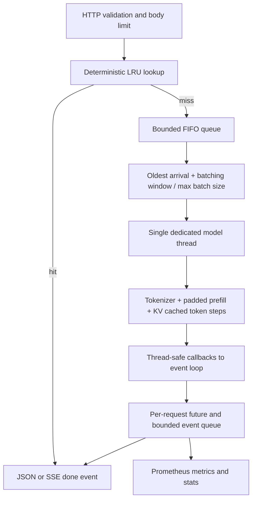

# Mini LLM Inference Server

A small, working inference service built around FastAPI, PyTorch and Hugging Face. Requests enter a bounded FIFO queue; a scheduler groups them into static dynamic batches; one dedicated model thread performs padded prefill and autoregressive decoding with a KV cache. The HTTP event loop stays available while the model runs.

The implementation follows [SPEC.md](SPEC.md). It includes normal generation, real SSE streaming, deterministic LRU caching, metrics, cancellation, queue/request deadlines, shutdown, tests and real HTTP benchmarks. The optional OpenAI chat endpoint and Redis are intentionally outside this version.

## Run locally

Python 3.12 is recommended. The default model is **HuggingFaceTB/SmolLM2-135M-Instruct**, small enough for a CPU. The first startup downloads its tokenizer and weights to `.cache/huggingface`. To use Qwen instead, set `MODEL_NAME=Qwen/Qwen2.5-0.5B-Instruct`. Prompts are used literally; there is no automatic chat template.

```bash
python -m venv .venv
# Linux/macOS:
source .venv/bin/activate
# Windows PowerShell instead:
# .\.venv\Scripts\Activate.ps1
python -m pip install -r requirements-dev.txt
python -m uvicorn app.main:app --host 127.0.0.1 --port 8000 --workers 1
```

For the already prepared local environment on this Windows machine:

```powershell
.\.venv\Scripts\python.exe -m uvicorn app.main:app --host 127.0.0.1 --port 8000 --workers 1
```

Open <http://127.0.0.1:8000/docs> for the interactive API reference. Startup waits for model loading; startup failure exits the service rather than reporting an unloaded worker as healthy. **Use one uvicorn worker**: multiple processes would each load their own model, queue and cache.

```bash
curl http://127.0.0.1:8000/generate \
  -H 'Content-Type: application/json' \
  -d '{"prompt":"Explain virtual memory in simple terms.","max_new_tokens":64,"temperature":0,"top_p":1}'

curl -N http://127.0.0.1:8000/generate \
  -H 'Content-Type: application/json' \
  -d '{"prompt":"A page fault happens when","max_new_tokens":64,"temperature":0.7,"top_p":0.9,"stream":true}'
```

PowerShell request:

```powershell
$body = @{prompt='Explain virtual memory.'; max_new_tokens=32; temperature=0; top_p=1} | ConvertTo-Json
Invoke-RestMethod http://127.0.0.1:8000/generate -Method Post -ContentType application/json -Body $body
```

## Architecture and ownership



* The **API** validates JSON and configuration limits and submits jobs. It never touches the model.
* The **scheduler** owns the pending deque, futures, cache, metrics and deadline monitor on the event loop. It sends a batch when full or when the oldest pending arrival reaches `BATCH_WAIT_MS`. Requests queued during an active batch are dispatched as soon as the model is available if their window already elapsed.
* The **worker** owns the model/tokenizer on a single executor thread. It left-pads prompts and supplies attention masks and per-row position IDs. Temperature, top-p, output budgets and EOS are handled per row, so different sampling settings can share a batch.
* This is **static dynamic batching**, not continuous batching: new rows do not join a batch already decoding. Finished/cancelled rows remain padded in that batch until all peers stop. Cancellation is checked between forward passes and cannot interrupt an in-progress PyTorch kernel.
* An extremely long padded combination that exceeds the model context is conservatively split into individual runs. The batch-size metric reports scheduler dispatch sizes, not the number of model forward calls. Keep `MAX_INPUT_TOKENS + MAX_OUTPUT_TOKENS` within the model context to avoid this rare fallback.

## Endpoints and streaming contract

| Endpoint | Behavior |
|---|---|
| `POST /generate` | Validated prompt and generation options; JSON result or SSE with `stream:true` |
| `GET /health` | 200 only while accepting requests, worker loaded and scheduler alive; otherwise 503 |
| `GET /metrics` | Prometheus exposition, with a private registry per app instance |
| `GET /stats` | JSON counters and scheduler config, used for benchmark deltas |
| `GET /docs` | FastAPI schema and request UI |

JSON includes `request_id`, `text`, `input_tokens`, `output_tokens`, `latency_ms`, `queue_time_ms`, `ttft_ms`, `finish_reason` (`eos` or `length`) and `cached`. Input count excludes left padding; output count includes sampled EOS if one was generated. Text excludes special tokens.

SSE emits:

```text
event: token
data: {"request_id":"...","text":"Hello ","token_id":123}

event: done
data: {"request_id":"...","text":"Hello world", ...full result...}
```

One `token` event is emitted per sampled token. `text` is a stable decoded delta; it can be empty until a whole word is available, avoiding partial UTF-8 text. The final token flushes the remaining text. Concatenated deltas equal the final `done.text`. TTFT measures the first sampled-token event, **not necessarily the first nonempty displayed word**. Cached streams emit a single `done` event with the full result and `cached:true`; they do not simulate token-by-token generation. Their model TTFT is null. Clients must handle this replay case.

Once SSE headers have been sent, failures are `event: error` with `{"error":"...","request_id":"..."}`; HTTP status cannot then change. Errors before stream creation return the normal HTTP error. Heartbeat comments are sent while no events are available. Consumers should regard a missing `done`/`error` as an incomplete stream.

## Reliability and limits

* `MAX_QUEUE_SIZE` bounds **waiting** requests; up to `MAX_BATCH_SIZE` more may be active. Full queue returns 503 `queue_full` and `Retry-After: 1`.
* Each SSE event queue is bounded by the maximum possible number of token events plus its terminal event. Output tokens, prompt characters and HTTP body bytes are bounded too. A slow consumer cannot accumulate an unbounded generated response, though connection-level admission is left to the deployment proxy.
* `QUEUE_TIMEOUT_S` applies before dispatch. `REQUEST_TIMEOUT_S` covers submission to terminal completion, including queue time. Checks use `perf_counter` with a 10 ms monitor interval. HTTP returns 504 with `queue_timeout` or `inference_timeout`; the worker gets a cooperative stop signal.
* Client disconnect cancels outstanding work. Completed futures ignore late callbacks. Cancelling one row leaves other rows intact. A failed batch reports `model_error` without killing the scheduler or exposing a traceback to the client; details are logged server-side.
* Shutdown first stops admission, fails queued jobs with `server_shutdown`, waits for the current batch (subject to existing request deadlines), closes the worker on its own thread, and joins the thread. A permanently wedged native call cannot be safely killed by Python threads; an external process supervisor is the last-resort shutdown boundary.
* The in-memory LRU caches only `temperature=0`, keyed by prompt, generation options and resolved model revision; it excludes transport choice. It does not deduplicate simultaneous cache misses. Greedy generation is used, but floating point behavior across devices/batch shapes need not be bitwise identical.
* No authentication, distributed serving, multi-GPU scheduling or persistent cache. Bind to localhost for direct local use. This is a systems-learning service, not a complete public multi-tenant platform.

## Configuration

Copy `.env.example` to `.env`, or set environment variables. Existing environment variables take precedence.

| Variable | Default | Meaning |
|---|---:|---|
| `MODEL_NAME` | `HuggingFaceTB/SmolLM2-135M-Instruct` | HF model ID or local path |
| `MODEL_REVISION` | `main` | Set an immutable revision for repeated experiments |
| `DEVICE` | `cpu` | `cpu`, `cuda`, `cuda:0`, or `auto` |
| `TORCH_THREADS` | 4 | CPU intra-op threads |
| `MAX_BATCH_SIZE` | 8 | Maximum requests dispatched together |
| `BATCH_WAIT_MS` | 20 | Window measured from oldest queued request |
| `MAX_QUEUE_SIZE` | 100 | Maximum live waiting jobs |
| `QUEUE_TIMEOUT_S` | 30 | Submission-to-dispatch deadline |
| `REQUEST_TIMEOUT_S` | 120 | Submission-to-result deadline |
| `MAX_INPUT_TOKENS` | 1024 | Checked after tokenization in the worker |
| `MAX_OUTPUT_TOKENS` | 512 | Per-request generation cap |
| `MAX_PROMPT_CHARS` | 16000 | Early character limit |
| `MAX_BODY_BYTES` | 131072 | Actual body limit, including chunked requests |
| `CACHE_SIZE` | 128 | LRU capacity in entries; 0 disables |
| `HF_CACHE_DIR` | `.cache/huggingface` | Model download cache |

Tokenization happens in the model worker. Therefore a context-length error may be an SSE terminal error after the stream started. Input limits never silently truncate prompts. Models must provide safetensors weights and implement standard causal `forward(input_ids, attention_mask, position_ids, past_key_values, use_cache)`; remote model code is not enabled. CPU uses float32; CUDA uses float16.

## Tests

```bash
python -m pytest -q
```

Default tests use a deterministic fake model to isolate concurrency logic. They cover validation, FIFO batching, oldest-arrival windows, full-batch immediate dispatch, bounded queues, cache eviction, request/result mapping at 1/4/8/16/32 clients, timeout, model failure recovery, cancellation, shutdown and real-socket early SSE delivery/disconnect.

Run the real-model correctness test separately. It compares a variable-length padded greedy batch against Hugging Face `generate` and checks that streamed deltas reconstruct the result:

```bash
RUN_MODEL_TESTS=1 python -m pytest tests/test_model.py -q
```

```powershell
$env:RUN_MODEL_TESTS='1'
.\.venv\Scripts\python.exe -m pytest tests/test_model.py -q
Remove-Item Env:RUN_MODEL_TESTS
```

## Docker

```bash
docker build -t mini-llm-server .
docker run --rm -p 8000:8000 -v mini-llm-models:/models mini-llm-server
# Or:
docker compose up --build
```

The Dockerfile installs CPU PyTorch, runs as a non-root user, exposes a health check and caches model files in `/models`. For GPU deployment use a matching CUDA/PyTorch base and runtime rather than this CPU image. Model download occurs at startup, not during image build. Container stop grace should exceed the active request deadline.

## Reproduce benchmarks

Against an existing server (configure batch size/window on the server):

```bash
python -m benchmarks.load_test --concurrency 8 --requests 100 --output-tokens 32 --stream --output results/stream.json
python -m benchmarks.load_test --concurrency 8 --requests 100 --repeat --output results/cache.json
python -m benchmarks.analyze_results results
```

For automatic server restarts across configurations:

```bash
python -m benchmarks.sweep --requests 16 --output-tokens 12 --output results/cpu_smollm2
python -m benchmarks.sweep --full --requests 100 --output-tokens 32 --output results/full
```

The default sweep covers no batching versus batching, 0/20/50 ms windows, streaming and cache on/off. `--full` adds all specified windows (0/5/10/20/50), batch sizes (1/2/4/8/16), and concurrency levels (1/4/8/16/32), as separate axis experiments. `--prompt-words` controls the generated prompt length in words; actual tokenizer counts are recorded per result. Batch settings are verified through `/stats`. Each scenario warms the model before measuring. The repeated-cache scenario warms that exact prompt to measure steady-state hits; it is not a cold-cache experiment.

Raw JSON contains every request, metadata and errors; CSV and Markdown tables are generated from those files. Latency/TTFT percentiles use linear interpolation over successful requests; throughput divides successful requests by total measurement duration. Failed requests are counted separately. `generated_tokens_per_s` excludes cache replay; `delivered_tokens_per_s` includes it. Server metrics begin after JSON validation; client measurements include HTTP overhead. Server histograms describe successful generations, while failures are counters. Benchmark model loads and warm-up are excluded.

Measured local results and their limitations are documented in [results/REPORT.md](results/REPORT.md). Small sample p95/p99 estimates are illustrative; use the full sweep and multiple repetitions before making performance claims.

## Measured CPU result

On this 8-logical-core Windows machine (4 PyTorch threads), the real SmolLM2-135M model served the following short runs: 16 measured requests each, up to 12 output tokens, one warm-up. All 128 measured requests across eight configurations succeeded.

| Mode | Clients | Avg batch | Req/s | Model tokens/s | p95 ms |
|---|---:|---:|---:|---:|---:|
| No batching | 8 | 1.0 | 0.41 | 4.87 | 20666.65 |
| Batch 8 / 20 ms | 8 | 4.0 | 0.89 | 10.66 | 11681.28 |
| Batch 8 / 50 ms | 8 | 8.0 | 1.21 | 14.54 | 7229.18 |
| Warm deterministic cache | 8 | 0.0 | 171.60 | 0.00 | 64.08 |

The 50 ms configuration reached about **3x** the unbatched throughput at 8 clients. It also reduced tail latency because larger batches drained the backlog faster: extra batching delay can be outweighed by less queue waiting under load. In this run 20 ms collected smaller batches and was not better than 0 ms; these few samples do not establish an optimal window. At low concurrency a batching window can simply add latency. Cache hits perform zero model decoding, so their throughput is deliberately not counted as new model tokens/s.

The streaming run had client TTFT p50 of **4.42 s**, versus total latency p50 **7.91 s**. These are CPU queueing/prefill measurements, not GPU serving targets. See [the measured report](results/REPORT.md) for all configurations, raw files, interpretation and limitations; use repeated larger sweeps for stable p95/p99 comparisons.

## Verification status

- **28 tests passed**, including the opt-in real-model comparison against Hugging Face generation, variable-length batched prompts, streaming reconstruction, real-socket disconnect and shutdown paths.
- Ruff checks/formatting and local dependency consistency checks pass.
- `docker compose config --quiet` passes. The CPU image also builds and runs successfully in Docker Desktop. An offline container smoke test with the real SmolLM2 model passed health, normal and concurrent generation, deterministic cache reuse, SSE streaming reconstruction, validation, metrics, and graceful stop. The measured benchmark runs below used native Python; the separate Docker smoke result is recorded in [`results/docker_smoke.json`](results/docker_smoke.json).

## Implementation references

The decode loop uses the attention-mask and KV-cache relationship described by [Hugging Face's cache guide](https://huggingface.co/docs/transformers/v4.50.0/en/cache_explanation). Request-disconnect handling follows [Starlette's request API](https://www.starlette.io/requests/). Exact package versions used for the local run are recorded in the results directory.
